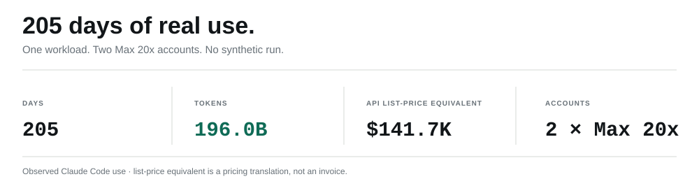
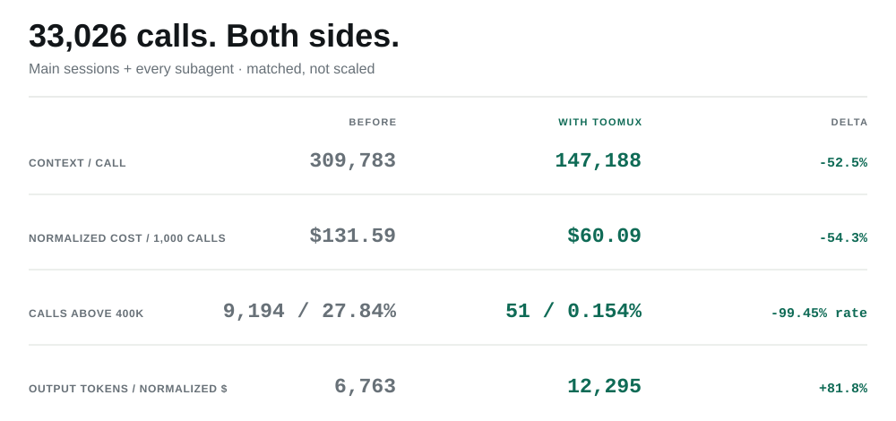
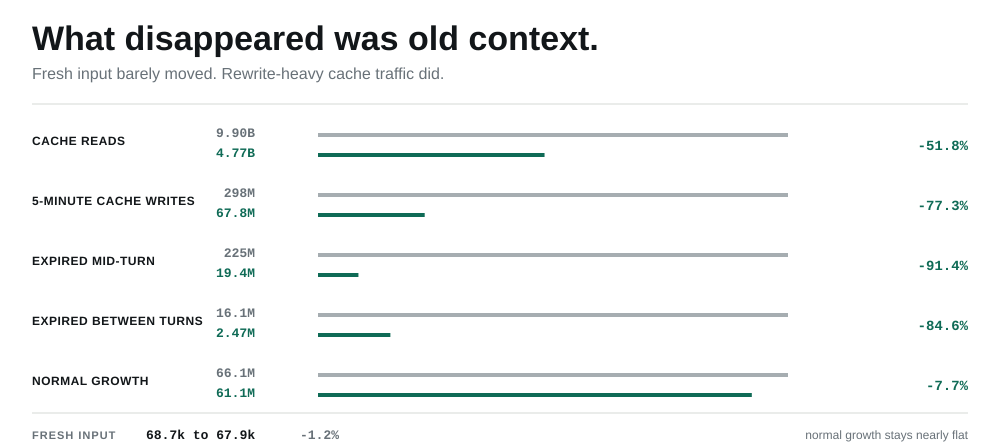
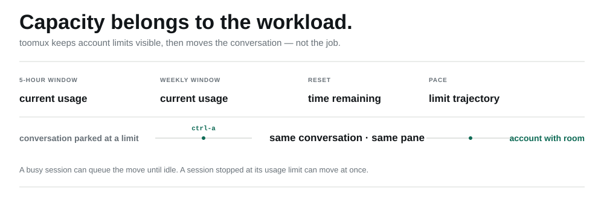
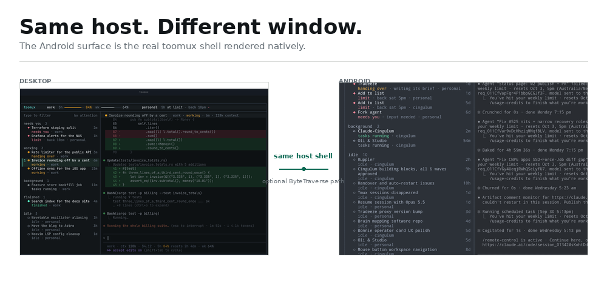
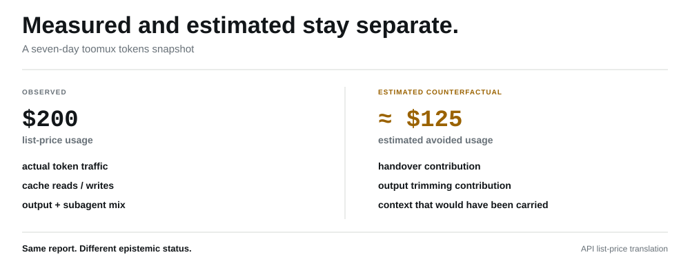
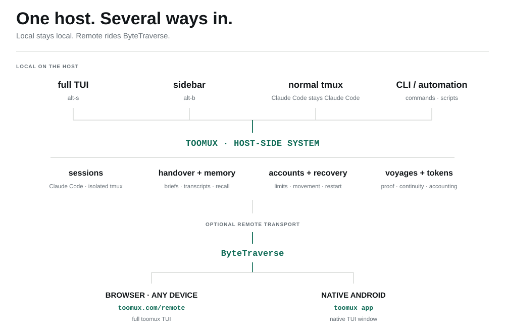

<p align="center">
  <picture>
    <source media="(prefers-color-scheme: dark)" srcset="assets/brand/logo/svg/toomux-logo-reversed.svg">
    <source media="(prefers-color-scheme: light)" srcset="assets/brand/logo/svg/toomux-logo-primary.svg">
    
  </picture>
</p>

<p align="center">
  <strong>Claude Code, minus the babysitting.</strong><br>
  Run many Claude Code sessions as one system: keep them moving, hand work over before context degrades,
  remember what they learned, and see what needs you from one place.
</p>

<p align="center">
  <a href="#install">Install</a> · <a href="GUIDE.md">Guide</a> · <a href="SECURITY.md">Security</a> · <a href="CHANGELOG.md">Changelog</a>
</p>

<p align="center">
  
</p>

<p align="center"><sub>Every session. Every account. What is working, what is waiting, and what needs you.</sub></p>

I run about ten Claude Code sessions across two Max 20x accounts. At any moment one is
coding, one is waiting on a permission prompt I have not seen, one has hit a usage
limit, and another has grown into an enormous context that it keeps carrying forward.

tmux kept the terminals alive. It did not coordinate the workload. Finished sessions
still went unnoticed, account capacity still needed manual juggling, and a long-running
piece of work was still tied to whichever conversation happened to start it.

I built toomux to deal with that. Everything in it came from running this way for real.

<picture>
  <source media="(max-width: 600px) and (prefers-color-scheme: dark)" srcset="assets/readme/proof-mobile-dark.svg">
  <source media="(max-width: 600px) and (prefers-color-scheme: light)" srcset="assets/readme/proof-mobile-light.svg">
  <source media="(prefers-color-scheme: dark)" srcset="assets/readme/proof-dark.svg">
  <source media="(prefers-color-scheme: light)" srcset="assets/readme/proof-light.svg">
  
</picture>

<p align="center"><sub>
Real-use snapshot, not a synthetic benchmark. Usage profiles:
<a href="https://ccgather.com/@meshbergio">CCGather</a> ·
<a href="https://www.viberank.app/profile/meshbergio">VibeRank</a>
</sub></p>

## What toomux does

**See the whole workload.** Sessions from every account are sorted by what needs
attention, with the selected Claude Code session live beside the list.

**Keep context sharp.** Long-running work hands over to a fresh session at a deliberate
boundary instead of depending on opaque compaction.

**Keep work moving.** Account limits, background work, restarts and handovers stop being
separate continuity problems.

**Know when “done” is actually done.** Voyages can keep working toward an outcome, run a
check, and send the session back for proof before accepting the result.

**Remember across sessions.** Conversations, handover briefs and project memory become
one searchable history instead of knowledge trapped in the current chat.

**Use the same system remotely.** The Android client is a native window onto the same
host-side toomux shell, not a separate mobile dashboard.

toomux does not replace Claude Code. It coordinates the Claude Code sessions you
already run.

### Try it

```sh
curl --proto '=https' --tlsv1.2 -fsSL https://raw.githubusercontent.com/meshbergio/toomux/master/install.sh | sh
```

macOS · Linux · WSL 2 · [complete installation](#install)

## Every session, one screen

`alt-s` opens toomux from anywhere in tmux. Each Claude Code conversation remains an
independent session, but the workload becomes one control surface: what is waiting on
you, what is working, what finished, what is idle, and which account it belongs to.

`enter` opens or reopens the selected session. `ctrl-a` moves that conversation to
another account in the same pane. Type to filter. `esc` clears the filter, backs out of
secondary views, then closes toomux.

If you would rather stay in your normal tmux layout, `alt-b` puts the same session list
down the side of the current window.

<p align="center">
  
</p>

The point is not a new terminal workflow. It is one layer above the tmux workflow you
already have.

## Handover instead of compaction

Long conversations can become expensive to carry and harder for a model to use well
before they simply run out of context. Anthropic describes the same general problem in
[its context-engineering guidance](https://www.anthropic.com/engineering/effective-context-engineering-for-ai-agents).

toomux treats that as a continuity problem rather than a reason to keep stretching one
conversation. By default, a main session becomes eligible to hand over at a natural
turn boundary after **250k tokens**. **400k tokens** is the hard handover threshold.

The original transcript is not replaced. The outgoing session writes an explicit
handover brief, updates durable memory, and the successor session receives that brief as
its starting context in the same pane. The old conversation remains intact and
searchable.

The useful question is whether that actually changes the workload, not whether the
mechanism sounds tidy.

<picture>
  <source media="(max-width: 600px) and (prefers-color-scheme: dark)" srcset="assets/evidence/matched-cohort-mobile-dark.svg">
  <source media="(max-width: 600px) and (prefers-color-scheme: light)" srcset="assets/evidence/matched-cohort-mobile-light.svg">
  <source media="(prefers-color-scheme: dark)" srcset="assets/evidence/matched-cohort-dark.svg">
  <source media="(prefers-color-scheme: light)" srcset="assets/evidence/matched-cohort-light.svg">
  
</picture>

> [!NOTE]
> **Matched, not scaled.** Exactly 33,026 calls on each side, including main
> sessions and every subagent. Both periods are repriced at the same Opus 5.5
> list rates so model-mix changes do not get credit for the difference. These
> are measurements from my workload, not a controlled benchmark of every
> Claude Code user.

Across that matched cohort, context per call fell from **309,783 to 147,188** and
normalized cost per 1,000 calls from **$131.59 to $60.09**. Calls above 400k fell from
**9,194 / 27.84%** to **51 / 0.154%**. Output tokens per normalized dollar rose from
**6,763 to 12,295**.

<picture>
  <source media="(max-width: 600px) and (prefers-color-scheme: dark)" srcset="assets/evidence/context-mechanism-mobile-dark.svg">
  <source media="(max-width: 600px) and (prefers-color-scheme: light)" srcset="assets/evidence/context-mechanism-mobile-light.svg">
  <source media="(prefers-color-scheme: dark)" srcset="assets/evidence/context-mechanism-dark.svg">
  <source media="(prefers-color-scheme: light)" srcset="assets/evidence/context-mechanism-light.svg">
  
</picture>

That does not prove handover is the only cause. It does show the change where the
mechanism predicts it should appear: less old context carried from call to call, with
fresh input nearly flat.

## Keep work moving

Context continuity is only useful if the work itself survives the things that interrupt
it.

### Account capacity

toomux tracks each account's five-hour and weekly windows, reset timing and recent pace.
`ctrl-u` opens the full usage view. If a conversation is parked on a limit, `ctrl-a`
can move that same conversation to an account with room; a busy session can queue the
move until it becomes idle.

<picture>
  <source media="(max-width: 600px) and (prefers-color-scheme: dark)" srcset="assets/readme/account-capacity-mobile-dark.svg">
  <source media="(max-width: 600px) and (prefers-color-scheme: light)" srcset="assets/readme/account-capacity-mobile-light.svg">
  <source media="(prefers-color-scheme: dark)" srcset="assets/readme/account-capacity-dark.svg">
  <source media="(prefers-color-scheme: light)" srcset="assets/readme/account-capacity-light.svg">
  
</picture>

### Background continuity

Captured background commands can be carried across a handover instead of forcing the
successor to wait for them. The session list distinguishes working, background, finished
and idle states, and notices surface sessions that need you. After a reboot, sessions
that were running reopen automatically by default, each in its own tmux server.

The unit of work should survive the terminal, conversation and account that happened to
start it.

## Voyages

Sometimes I do not want to manage the next turn. I want to describe the outcome and
come back when it is actually true.

```text
/voyage the auth tests pass --check "cargo test auth" --budget 40
```

After each turn, toomux evaluates whether the stated outcome has been met. If not, the
session is sent back with what is still missing. A voyage carries across handovers and
can continue after a usage limit lifts. `--check` gives the outcome a concrete command
that must pass.

<p align="center">
  
</p>

Persistence controls how hard “done” is to reach:

**light** · **steady** · **hard** · **relentless**

`steady` is the default. `hard` adds one proof lap. `relentless` adds two proof laps
and then a skeptical review of the diff since the voyage began. The full stopping and
retry rules are in the [Voyages guide](GUIDE.md#voyages).

### Proof laps

A proof lap deliberately distrusts a successful-looking result. Once the judge says the
outcome is met, the session is sent back to re-run the evidence and inspect its own
changes. If that reveals a skipped test, stub, TODO or other contradiction, the voyage
returns to work instead of accepting the earlier claim. A lap is not a second summary;
it is another execution turn with a narrower job: try to falsify “done.”

<details>
<summary><strong>See a proof lap catch a false “done”</strong></summary>

<p align="center">
  
</p>

</details>

## Memory that survives the session

The answer does not have to be in the current conversation.

A session in one project can search what another session learned in another project,
find the earlier decision, and reuse it without making you reconstruct the history.

<p align="center">
  
</p>

toomux indexes conversations as they happen alongside handover briefs and each project's
Claude Code memory files. A handover asks the outgoing session to update durable project
memory before it leaves. Quiet transcript files are archived compressed and kept past
Claude Code's default cleanup period, so a complete old turn can still be recovered when
needed.

### See how the work connects

What feels like one body of work can span many sessions. The memory graph makes that
lineage explicit: the session that wrote a brief, the one that continued from it, the
turns and kept outputs around them, and the memory each session found or read.

<p align="center">
  
</p>

<details>
<summary><strong>See the graph inside the TUI</strong></summary>

<p align="center">
  
</p>

</details>

## The same toomux on Android

The Android app is not a second dashboard. It is a native window onto the same toomux
shell running on the host, with the same sessions, state, keyboard model and memory.

<picture>
  <source media="(max-width: 600px) and (prefers-color-scheme: dark)" srcset="assets/readme/android-continuity-mobile-dark.png">
  <source media="(max-width: 600px) and (prefers-color-scheme: light)" srcset="assets/readme/android-continuity-mobile-light.png">
  <source media="(prefers-color-scheme: dark)" srcset="assets/readme/android-continuity-dark.png">
  <source media="(prefers-color-scheme: light)" srcset="assets/readme/android-continuity-light.png">
  
</picture>

For each paired device, the host starts an isolated `toomux shell`, captures its ANSI
cell grid, and the Android app renders that grid natively and sends input back. The
ordinary app surface is a native Android view; the self-contained browser memory graph
is the only WebView surface.

Remote access is opt-in. ByteTraverse provides the encrypted device-to-host path;
toomux adds separate per-device application authentication on top. The production
endpoint defaults to `10.30.0.1:7462`, pairing creates a one-time code, and the Android
bearer token is encrypted at rest with a non-exportable Android Keystore key. The exact
boundary is documented in the [Android guide](android/README.md).

## Where the tokens went

`toomux tokens` is an accounting report, not one blended “savings” number. It separates
what the Claude sessions actually used from estimates of context that toomux avoided
carrying forward.

<picture>
  <source media="(max-width: 600px) and (prefers-color-scheme: dark)" srcset="assets/readme/token-accounting-mobile-dark.svg">
  <source media="(max-width: 600px) and (prefers-color-scheme: light)" srcset="assets/readme/token-accounting-mobile-light.svg">
  <source media="(prefers-color-scheme: dark)" srcset="assets/readme/token-accounting-dark.svg">
  <source media="(prefers-color-scheme: light)" srcset="assets/readme/token-accounting-light.svg">
  
</picture>

Observed token and cache traffic can be priced at API list rates. Counterfactual
“avoided” context is necessarily an estimate. The seven-day report captured below
contains about **$200 of observed list-price usage** and **$125 of estimated avoided
usage**; those two categories are deliberately not presented as the same kind of
measurement.

<details>
<summary><strong>See the complete token report</strong></summary>

<p align="center">
  
</p>

</details>

## How it fits together

The product is easier to trust when the boundaries are visible.

<picture>
  <source media="(max-width: 600px) and (prefers-color-scheme: dark)" srcset="assets/readme/architecture-mobile-dark.svg">
  <source media="(max-width: 600px) and (prefers-color-scheme: light)" srcset="assets/readme/architecture-mobile-light.svg">
  <source media="(prefers-color-scheme: dark)" srcset="assets/readme/architecture-dark.svg">
  <source media="(prefers-color-scheme: light)" srcset="assets/readme/architecture-light.svg">
  
</picture>

**Claude Code stays Claude Code.** toomux coordinates sessions around it; local session
coordination does not proxy Claude Code model traffic through a separate AI service.

**Sessions stay isolated.** Every session that toomux starts, reopens or adopts runs in
its own tmux server, so one server failing does not take the others with it.

**Remote access is optional.** Local use does not require the Android path or a remote
listener.

**Memory is inspectable.** Handover briefs, archived transcripts, project memory and the
memory graph are files and records you can inspect, search and rebuild rather than
invisible model state.

## Install

### Homebrew

macOS:

```sh
brew install meshbergio/tap/toomux
```

Homebrew installs tmux too.

### npm

Linux, macOS, or from Windows with a WSL 2 distribution:

```sh
npm install -g toomux
```

The npm package installs the matching toomux binary. On Windows, the launcher delegates
into WSL 2 rather than pretending to provide a native Windows tmux port.

### Shell installer

Linux or macOS:

```sh
curl --proto '=https' --tlsv1.2 -fsSL https://raw.githubusercontent.com/meshbergio/toomux/master/install.sh | sh
```

The installer verifies the published checksum and writes the binary to
`~/.local/bin` by default. It does not configure tmux or Claude Code until you run
`toomux init --apply`.

### Requirements

Linux or macOS, or Windows through WSL 2; tmux 3.2 or later; Claude Code.

### First run

```sh
toomux init --apply
```

That installs the toomux tmux bindings and status segment, configures the Claude Code
status line and hooks it needs, and registers the toomux MCP server. It keeps backups of
files it edits.

If you use more than one Claude Code account:

```sh
toomux account setup
```

Then press `alt-s` anywhere in tmux.

### Configuration

Defaults are intentionally useful out of the box, including handover, transcript
archiving, restart recovery and memory upkeep. `toomux init` writes the config;
`toomux where` shows every config/state/archive location. The complete setting
reference is in the [Guide](GUIDE.md#setup).

### Android

The signed Android APK is attached to tagged releases. The Android client needs an
existing ByteTraverse route to the host; then run:

```sh
toomux remote serve
toomux remote pair
```

The app defaults to `http://10.30.0.1:7462`. Setup, revocation and the exact security
boundary are in [android/README.md](android/README.md).

### Upgrade

Homebrew:

```sh
brew upgrade toomux
```

npm:

```sh
npm install -g toomux@latest
```

Shell install: rerun the installer command above.

### Uninstall

```sh
toomux uninstall
```

`toomux uninstall --dry-run` shows what would be removed first. `--purge` also
deletes toomux's own config, state and transcript archive; your Claude Code memory
folders are not touched.

---

**Documentation**<br>
[Guide](GUIDE.md) · [Security](SECURITY.md) · [Benchmarks](BENCHMARKS.md) ·
[Changelog](CHANGELOG.md) · [Contributing](CONTRIBUTING.md)

MIT or Apache 2.0, your pick:
[MIT](LICENSE-MIT) · [Apache 2.0](LICENSE-APACHE).
