<p align="center">
  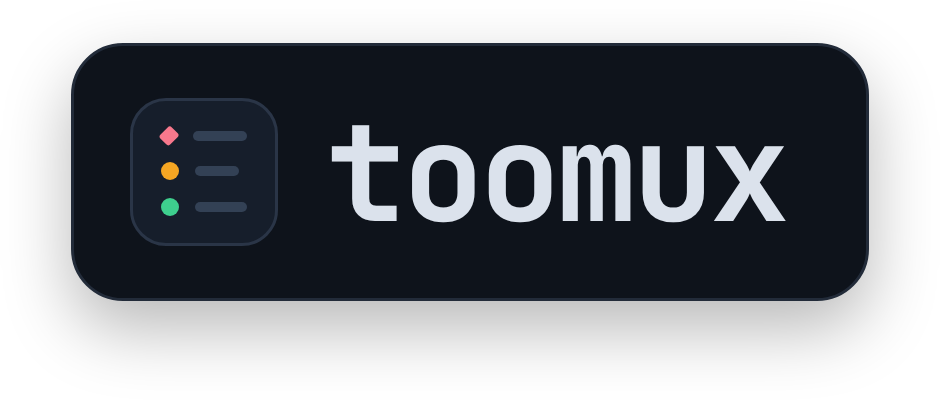
</p>

<p align="center">
  <b>Claude Code, minus the babysitting.</b><br>
  Every Claude Code session and account, in one place in tmux.
</p>

<p align="center">
  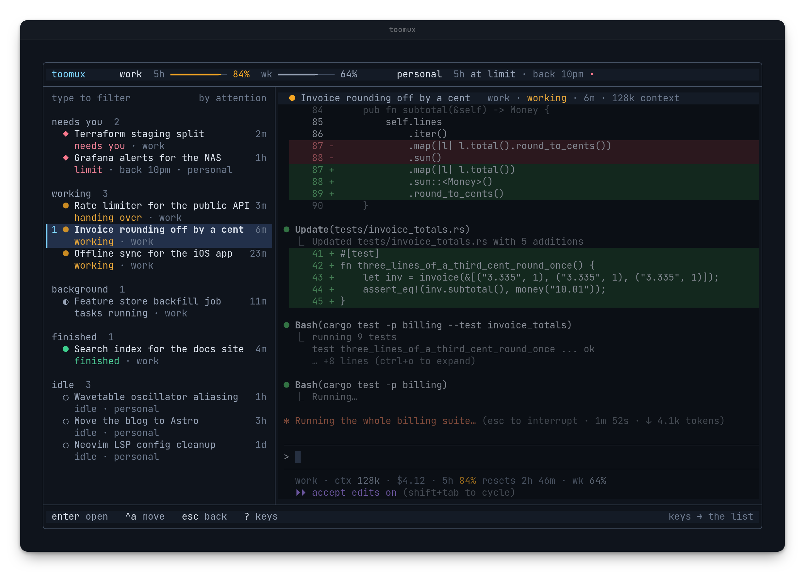
</p>

I run ten or so Claude Code sessions across two Max 20x accounts. At any moment
one is waiting on a permission prompt I haven't seen, one has hit its limit, and
one is 800k tokens deep, re-reading all of it on every call.

I built toomux to deal with that. Everything in it I learned the hard way.

<p align="center">
  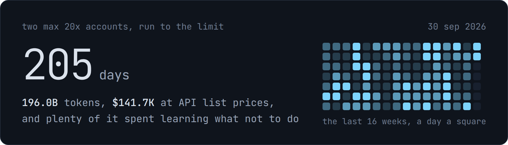<br>
  #5 on <a href="https://ccgather.com/@meshbergio">ccgather</a> · #20 on <a href="https://www.viberank.app/profile/meshbergio">viberank</a>
</p>

## What it does

<div align="center">
<table>
<tr>
<td valign="top" align="left" width="50%">
<h3>&nbsp; Short, sharp sessions</h3>
<a href="#handover-instead-of-compaction">Handover instead of compaction</a><br>
Subagents and forks hand over too<br>
Background jobs survive the move<br>
Long output kept whole, shown short
</td>
<td valign="top" align="left" width="50%">
<h3>&nbsp; Keeps going without you</h3>
<a href="#voyages">Voyages</a> run until the job's done<br>
<kbd>ctrl-a</kbd> moves to an account with room<br>
A ping when a session needs you<br>
Everything reopens after a reboot
</td>
</tr>
<tr>
<td valign="top" align="left" width="50%">
<h3>&nbsp; One screen</h3>
<a href="#every-session-one-screen"><kbd>alt-s</kbd></a> sorted by what needs you<br>
<kbd>alt-b</kbd> the list beside any window<br>
<a href="#accounts-and-limits"><kbd>alt-u</kbd></a> every account's limits<br>
Cost and cache timer per session
</td>
<td valign="top" align="left" width="50%">
<h3>&nbsp; Remembers everything</h3>
<a href="#one-memory-for-every-session">One memory</a> for every session<br>
<a href="#the-memory-graph">The memory graph</a>, TUI and browser<br>
Transcripts kept past 30 days<br>
<a href="#where-the-tokens-went">Where the tokens went</a>, daily
</td>
</tr>
<tr>
<td valign="top" align="left" width="50%">
<h3>&nbsp; Out of the way</h3>
One Rust binary, about 9MB<br>
No daemon, no proxy<br>
Each session in its own tmux server<br>
<code>toomux uninstall</code> removes it all
</td>
<td valign="top" align="left" width="50%">
<h3>&nbsp; Install</h3>
<a href="#get-it">One command to install</a><br>
Linux, macOS, WSL 2<br>
MIT or Apache 2.0
</td>
</tr>
</table>
</div>

## Handover instead of compaction

Every call re-reads the whole conversation. At 800k tokens that's $0.16 a call,
or $6.40 if the cache has gone cold. On a Max plan it eats your limits instead.
And the model gets worse at using what's in front of it as the context grows.
[Anthropic say so
themselves](https://www.anthropic.com/engineering/effective-context-engineering-for-ai-agents).

When the context fills up, Claude Code compacts: it summarises the conversation
and carries on. That usually happens mid-task, and details get lost.

toomux hands over well before that. Once a session passes 250k and finishes
its turn, it writes a brief, saves what it learned to memory, and a fresh
session picks up in the same pane. Nothing is summarised, and the old
conversation stays searchable.

<p align="center">
  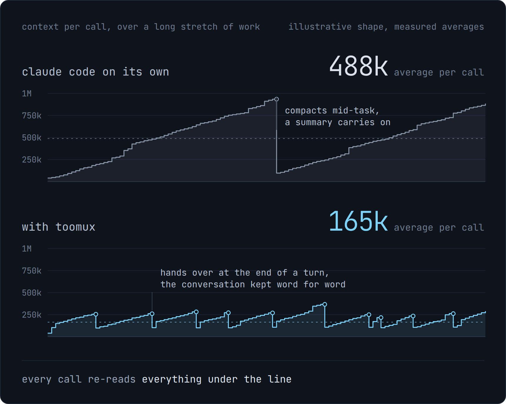
</p>

<p align="center">
  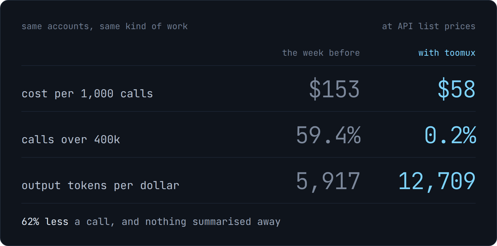
</p>

My own numbers from `toomux tokens`, the week before toomux against the first
day with it. I run handover at 200k.

Every handover stays linked to the one before it. Here's one piece of work
carried across 22 sessions, in the memory graph:

<p align="center">
  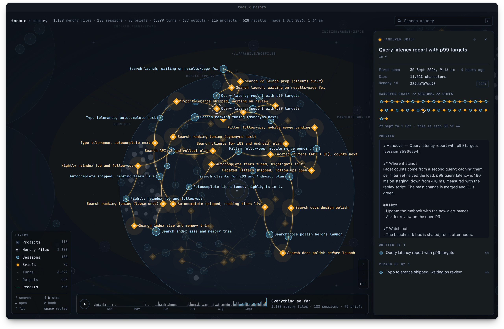
</p>

## Voyages

Tell a session what done looks like, and it keeps working until it gets there.
You don't have to sit and watch it.

```
/voyage the auth tests pass --check "cargo test auth" --budget 40
```

That session works until the auth tests pass, proves it by running
`cargo test auth`, and stops if it has spent $40.

<p align="center">
  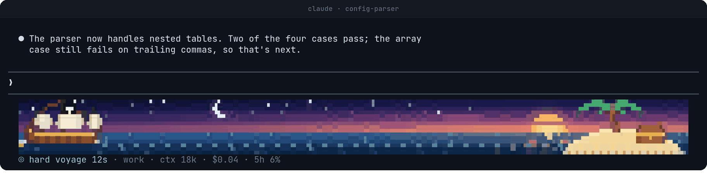
</p>

The ship sails towards the island as the work gets done. She drops anchor while
the voyage waits on you or on a usage limit, and lands when it's finished.

**Why not `/goal`?** Claude Code's `/goal` also checks after every turn, but it
lives in one conversation. That conversation grows until the goal is met, often
to the full 1M window, and it stops dead at a usage limit. A voyage hands over
to a fresh session, waits out the limit, pauses at its budget, and can make the
session prove it's done.

**How hard it pushes** is up to you. `light` takes the session's word for it.
`steady`, the default, wants to see the proof. `hard` sends it back for a proof
lap first: a clean re-run, and a read over its own changes. `relentless` runs
two laps, the second one trying to break it, then a sceptical review of every
change.

<p align="center">
  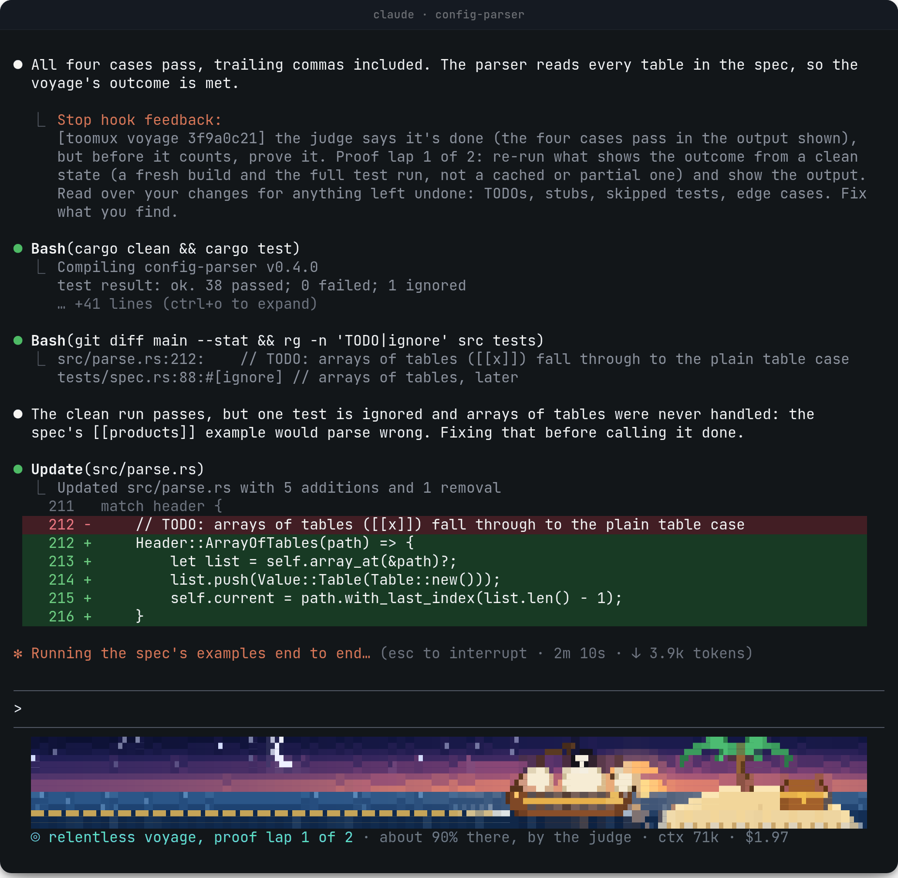
</p>

That's a proof lap. The judge said done because four cases passed. The lap
turned up a TODO and a skipped test that the claim had hidden.

A check costs about $0.001 with Haiku. The levels, the judge's models and every
command are in [the guide](GUIDE.md#voyages).

## Every session, one screen

Press `alt-s` anywhere in tmux to open toomux full screen: every session, sorted
by what it needs from you, with the selected one live next to the list. Reply
right there, or press `alt-j` to jump to it.

<p align="center">
  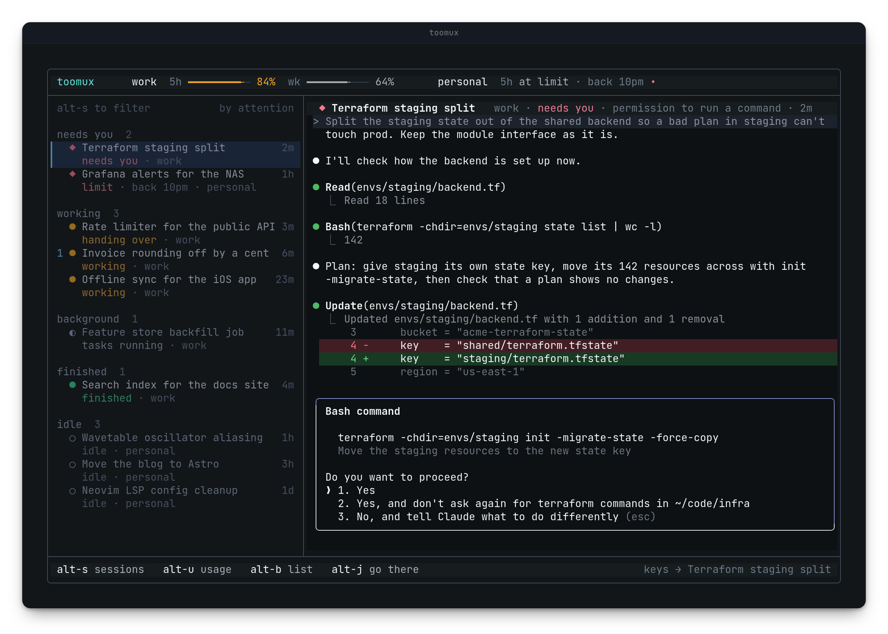
</p>

Sessions sort themselves by what they need from you: waiting on you, working,
running in the background, finished, idle. Type to filter, group by account or
project, and pin the ones you live in to `alt-1` to `alt-9`. Each one shows what
it has cost so far and how long its cache stays warm, so you know when coming
back to it will be expensive.

Rather stay in tmux? `alt-b` keeps the list down the side of any window, and the
status bar tells you the moment something needs you.

<p align="center">
  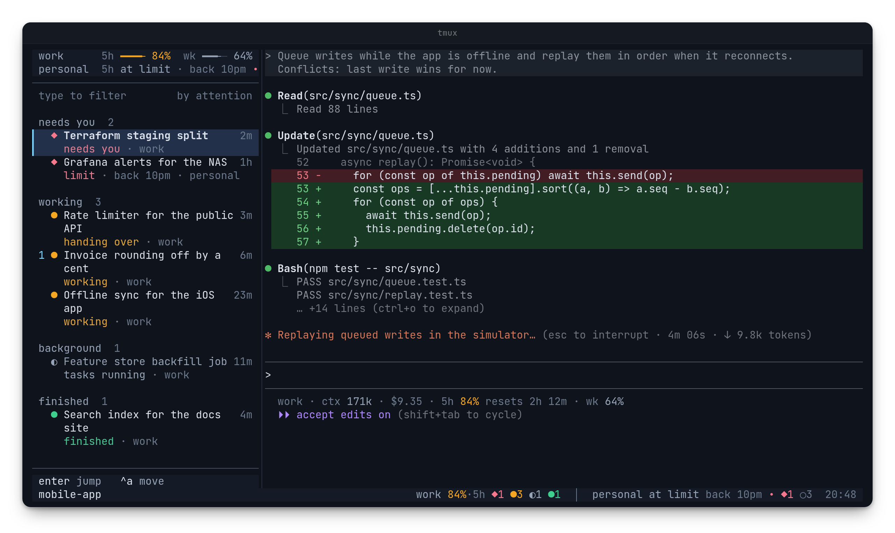
</p>

`ctrl-n` starts a new session in a recent folder, on the right account.
`ctrl-o` pulls a session running in a plain terminal into tmux.

## Android over ByteTraverse

The native Android client in [`android/`](android/) is a window onto the real
toomux shell, not a second mobile dashboard. The host runs an isolated
`toomux shell` for the paired device; Android renders that exact ANSI cell grid
natively and sends touch, keyboard and mouse-equivalent input back to it.
Grouping, filters, account limits, session menus, the live Claude pane, usage,
help and the `alt-m` memory graph therefore use the same code and interaction
model as the desktop TUI.

The normal app surface is a native Kotlin `View`, not a WebView. From the
memory TUI, `o browser` opens toomux's existing self-contained GUI memory
explorer full-screen on the device; that isolated page is the only WebView
surface and external network requests are blocked.

Remote access is opt-in. `toomux remote serve` listens on `10.30.0.1:7462` by
default and refuses non-ByteTraverse addresses and peers. `toomux remote pair`
makes a one-time eight-digit code; the Android app exchanges that for a
per-device token, which is held under Android Keystore. Joining the ByteTraverse
mesh alone is not authority to control toomux.

ByteTraverse remains the network layer rather than being copied into the app.
That keeps its VPN/transport lifecycle separate, keeps toomux's MIT/Apache
licensing boundary clear, and means the remote API is reachable only after the
device can already reach `10.30.0.1` over ByteTraverse. Setup and the exact
security boundary are in [the Android guide](android/README.md).

## Accounts and limits

When an account hits its limit, `ctrl-a` moves the conversation to one with room,
in the same pane. `alt-u` shows each account's 5-hour and weekly usage, and when
you'll hit the limit at your current pace.

Accounts can also share one history, so any conversation resumes under any of
them and they all read the same memory.

<p align="center">
  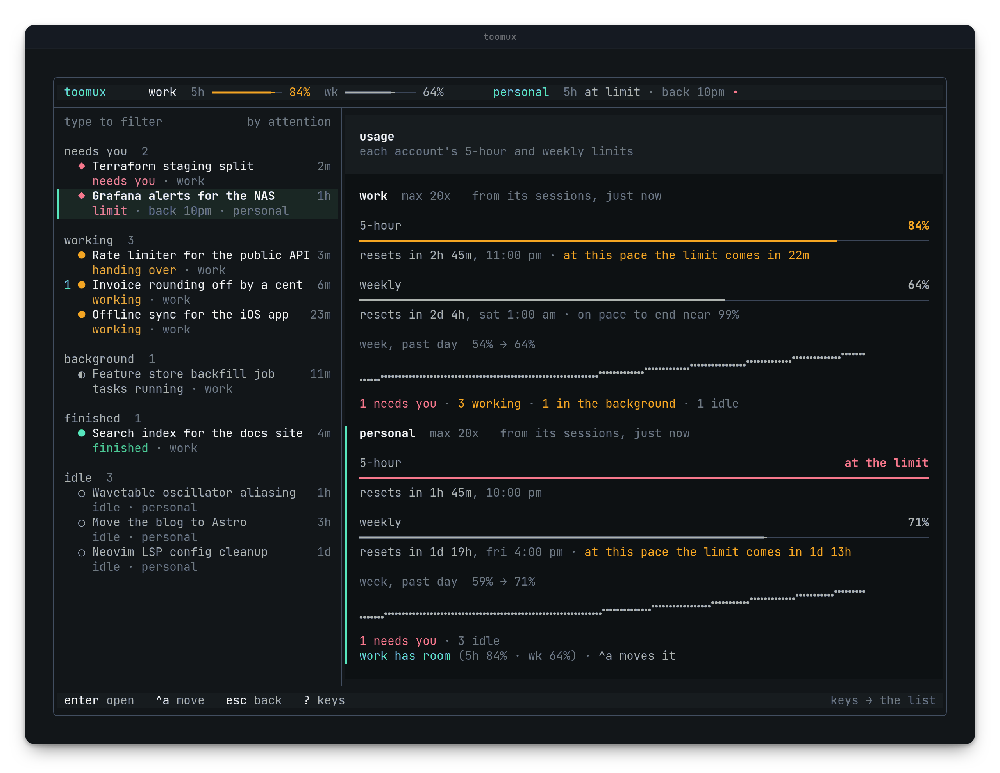
</p>

## One memory for every session

Every conversation is indexed as it happens, along with handover briefs and
every project's Claude Code memory files. Any session can search all of it, in
any project, so you don't have to explain things twice.

<p align="center">
  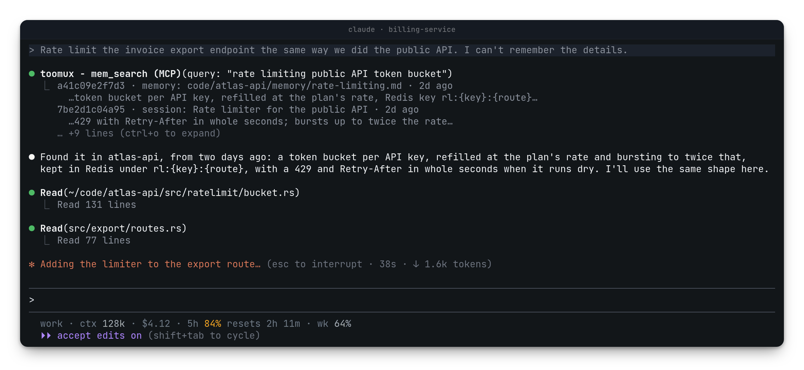
</p>

A session updates its project's memory before it hands over, and once an hour
toomux fixes memory files that point at folders you've since moved. Transcripts
are kept past Claude Code's 30-day cleanup.

### The memory graph

`toomux graph --open` draws all of it in your browser: every project, its
memory files, the sessions that ran there, the briefs they handed over with, and
what each one looked up. Scrub the timeline to watch it grow.

<p align="center">
  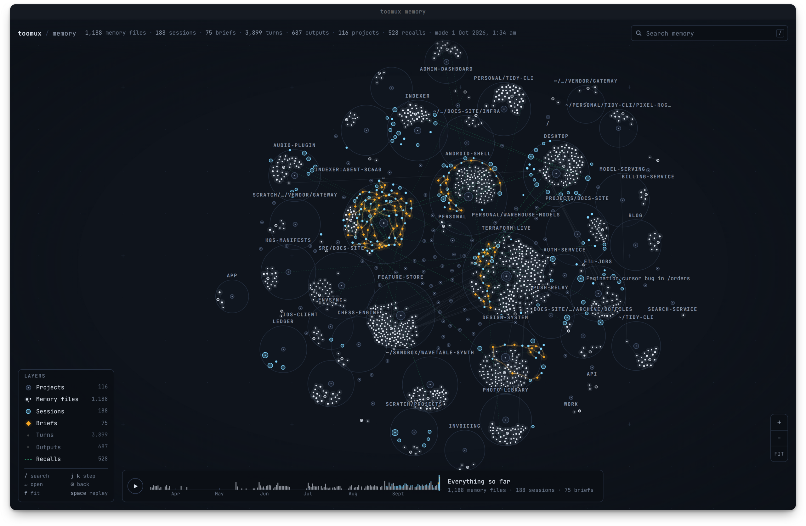
</p>

`alt-m` shows the same graph right in toomux. Enter on anything gathers its
links around it.

<p align="center">
  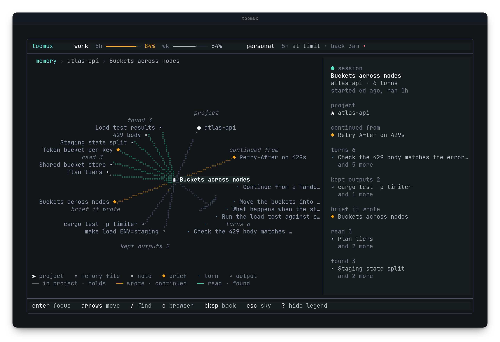
</p>

## Where the tokens went

`toomux tokens` shows what your sessions used, what toomux saved, and where the
money went. Once a day, a one-line digest of yesterday arrives as a notice.

<p align="center">
  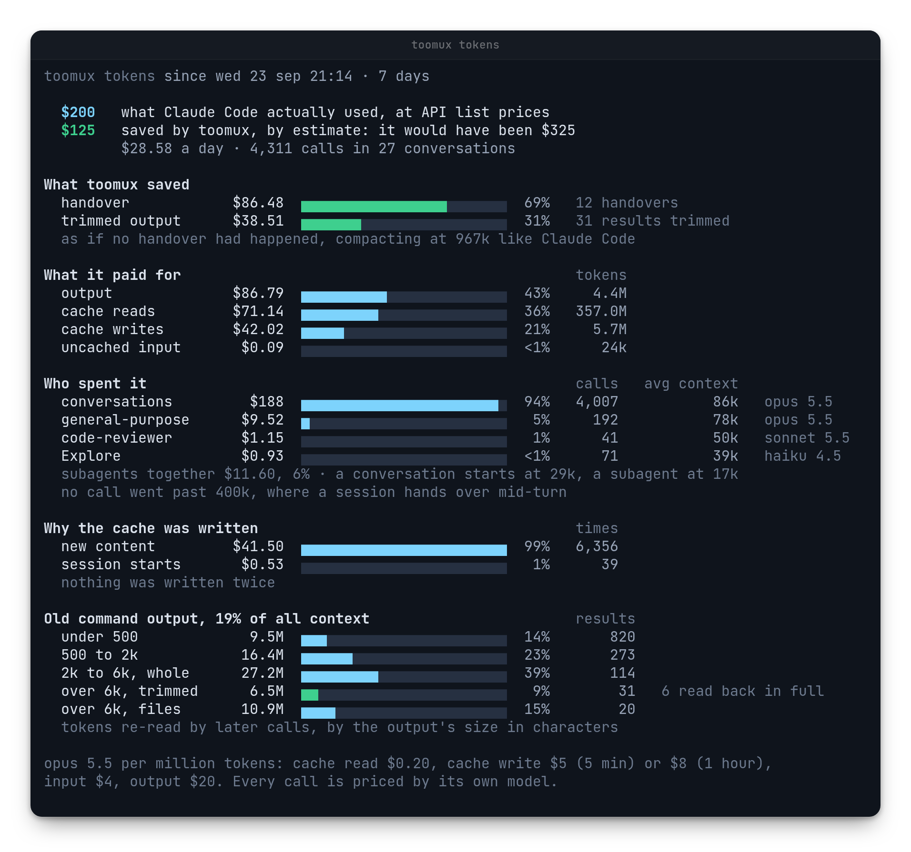
</p>

## Coming soon

- **Codex.** Codex sessions in the same list as Claude Code ones.
- **Local models.** Sessions running on models you host yourself.

## Get it

```sh
curl --proto '=https' --tlsv1.2 -fsSL https://raw.githubusercontent.com/meshbergio/toomux/master/install.sh | sh
toomux init --apply
```

On a Mac, Homebrew is easier. It brings tmux too, and `brew upgrade` keeps
toomux current:

```sh
brew install meshbergio/tap/toomux
toomux init --apply
```

Or with npm, anywhere: `npm install -g toomux`. On Windows the npm launcher
hands off to your default WSL 2 distribution and installs the matching toomux
release there on first run.

Then press `alt-s` in tmux. You'll need Linux or macOS (Windows through WSL 2),
tmux 3.2 or later, and Claude Code. Everything is on by default, each part turns
off with one line, and `toomux uninstall` removes it all. It also tidies
finished git worktrees once a day, and never touches branches or uncommitted
work. Every key and setting is in [the guide](GUIDE.md).

If it helps, a star is appreciated.

Project notes: [security](SECURITY.md) · [contributing](CONTRIBUTING.md) ·
[changelog](CHANGELOG.md) · [reproducible performance measurements](BENCHMARKS.md).

<p id="licence">MIT or Apache 2.0, your pick: <a href="LICENSE-MIT">MIT</a>, <a href="LICENSE-APACHE">Apache 2.0</a>.</p>
